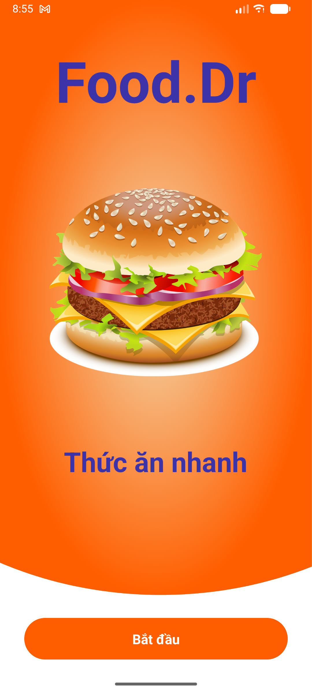
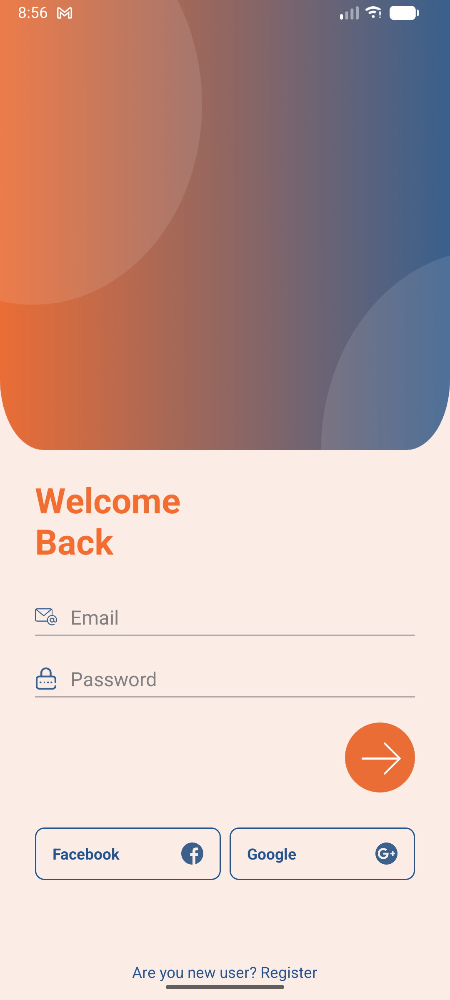
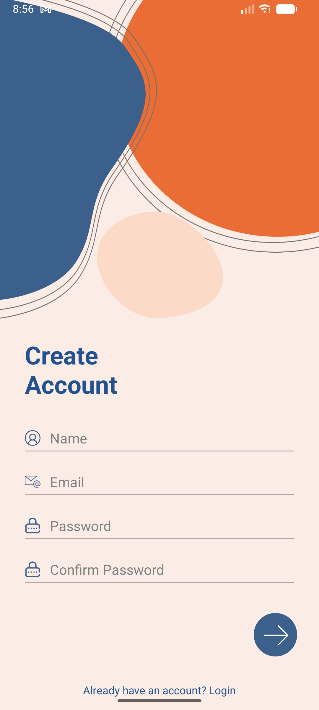
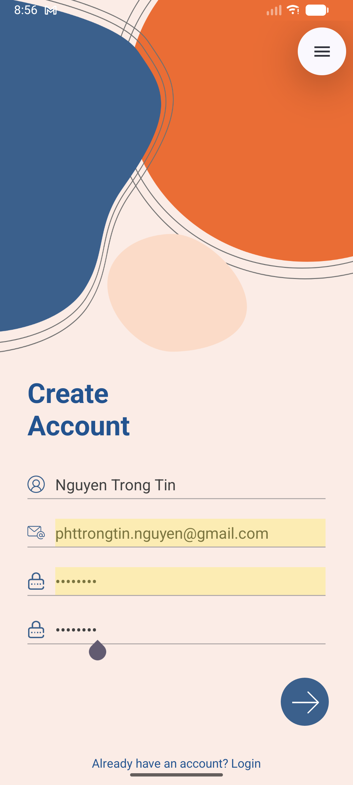
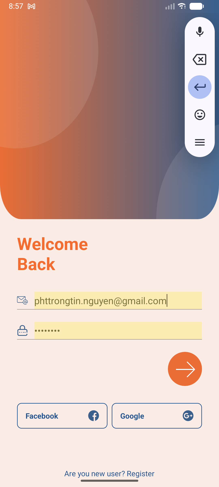
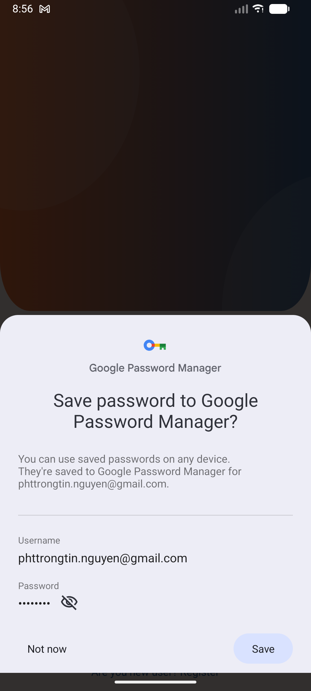
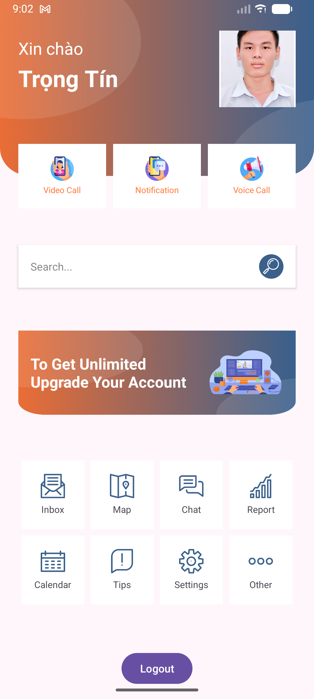
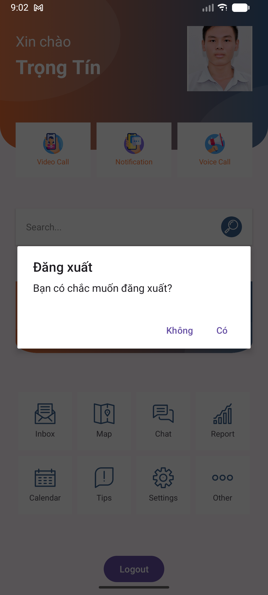

# Week2_Bai3_LoginRegister — Lập trình di động 02 (Android/Java)

Bài tập tuần 2 môn **Lập trình di động 02 – MOPR**.  
Yêu cầu: thiết kế app **Login & Register UI** với flow đầy đủ Intro → Login → Register → Home, giống slide hướng dẫn của giảng viên.

---

## 1. Nội dung & trạng thái

- ✅ Màn hình **Intro** (Food.Dr):
  - Logo, hình burger, slogan *"Thức ăn nhanh"*
  - Nút **Bắt đầu** chuyển sang màn Login
- ✅ Màn hình **Login**:
  - Nhập **Email** và **Password**
  - Nút mũi tên màu cam để đăng nhập
  - Link chuyển sang **Register**: *"Are you new user? Register"*
  - Nút social: **Facebook**, **Google** (UI)
- ✅ Màn hình **Register**:
  - Nhập **Name**, **Email**, **Password**, **Confirm Password**
  - Nút mũi tên tạo tài khoản
  - Link quay về Login: *"Already have an account? Login"*
- ✅ Màn hình **Home**:
  - Hiển thị lời chào: *"Xin chào Trọng Tín"*
  - Avatar cá nhân
  - 3 card chức năng trên: **Video Call**, **Notification**, **Voice Call**
  - Ô tìm kiếm (Search)
  - Banner *"To Get Unlimited Upgrade Your Account"*
  - Grid 3x3: **Inbox, Map, Chat, Report, Calendar, Tips, Settings, Other**
  - Nút **Logout** ở dưới cùng
- ✅ **Logout dialog**:
  - Hiện dialog: *"Đăng xuất – Bạn có chắc muốn đăng xuất?"* với nút **Không / Có**

App chạy được trên emulator **Medium Phone API 36** và thiết bị thật (Android 14), đã test các flow cơ bản.

---

## 2. Flow màn hình (demo quá trình chạy)

### 2.1 Intro → Login

1. Mở app, vào màn hình **Intro Food.Dr**:

   

2. Nhấn nút **Bắt đầu** → chuyển sang màn hình Login:

   

---

### 2.2 Đăng ký tài khoản mới

3. Ở màn Login, bấm link **"Are you new user? Register"** → mở màn **Create Account**:

   

4. Nhập đầy đủ **Name, Email, Password, Confirm Password** rồi nhấn nút mũi tên để tạo tài khoản:

   

5. Sau khi đăng ký thành công, app quay về Login (hoặc hiển thị thông báo phù hợp).

---

### 2.3 Đăng nhập → Google Password Manager → Home

6. Nhập email & password ở màn hình Login rồi nhấn nút mũi tên:

   

7. Nếu dùng thiết bị thật, **Google Password Manager** có thể hiện popup hỏi lưu mật khẩu:

   

8. Đăng nhập thành công → chuyển sang **Home screen**:

   

---

### 2.4 Logout

9. Nhấn nút **Logout** ở dưới cùng màn Home → hiện dialog xác nhận:

   

10. Chọn **Có** để đăng xuất (quay lại Login), chọn **Không** để ở lại màn Home.

> Ghi chú: `docs/screenshots/anh_09.png` là thêm một góc chụp khác của màn Login, dùng làm minh hoạ bổ sung.

---

## 3. Cách chạy dự án

1. Clone repo:

   ```bash
   git clone https://github.com/YueLouis/Week2_Bai3_LoginRegister.git
   cd Week2_Bai3_LoginRegister
